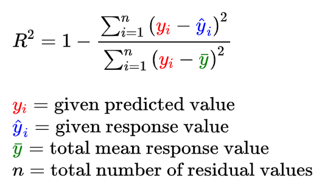
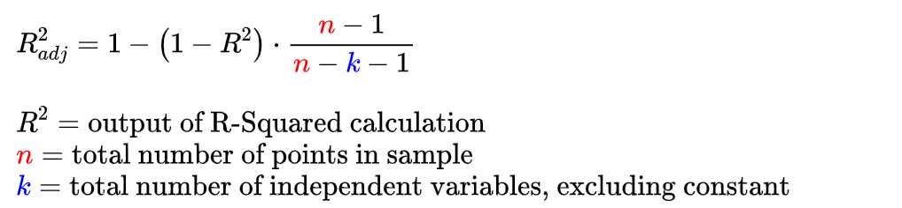

## About

This notebook isn't really about code as much as it's about math. As my knowledge grows with respect to statistics and data science, this notebook will gradually expand, and the organizational structure will shift to accommodate. All math formulas were made using my custom tool at: <https://christopherball.github.io/math/asciiMath/>.

## Model Accuracy

------------------------------------------------------------------------

#### Root Mean Square Error

{width="300"}

**Summary**: Given a set of numeric model predictions, and their corresponding observational response values, for every prediction, we're basically diffing how far off our prediction is, squaring that diff to eliminate negative sign issues, summing up all of these across our set, taking the mean of these values, and finally taking the square root to bring the final value back into the same scale as the predictions and observations.

**Interpretation**: Numbers are absolute values in the same unit as the predicted / observation values. As a model improves and matures, your RMSE should get smaller and smaller because your predictions should become closer and closer to the actual observational values (as modeled by a linear regression, etc...).

------------------------------------------------------------------------

#### R-Squared

{width="300"}

**Summary**: Otherwise known as the "Coefficient of Determination", to be used for assessing model accuracy where only one independent variable is used in the model. If you add more independent variables, R-squared will go up which is why you should use Adjusted R-Squared instead for such situations (see below). For normal R-squared, you can think of the numerator as "explained variation" and the denominator as "total variation".

**Interpretation**: Results are always between 0 and 100%, with higher *generally* being better. That is, high R-squared percentages signal a prediction model that likely fits (explains) the data well. There are exceptions to this rule however. It's fairly common for R-squared results to be high, but when you look closely at the prediction curve of the model compared to the response data, there can be a pattern (bias) where certain areas of the model consistently under or over-predict response values. This is confirmed by looking at a "residuals versus fits" plot and looking for patterns (you want to see randomness).

------------------------------------------------------------------------

#### Adjusted R-Squared

{width="550"}

**Summary**: Like R-Squared, Adjusted R-Squared also indicates how well a model curve explains response values. Unlike regular R-Squared, the Adjusted version handles models that are built on top of multiple independent variables, and will penalize the score if additional independent variables don't add to the model accuracy. Adjusted R-Squared values can't be higher than regular R-Squared.

**Interpretation**: Precisely the same as normal R-Squared.

------------------------------------------------------------------------
